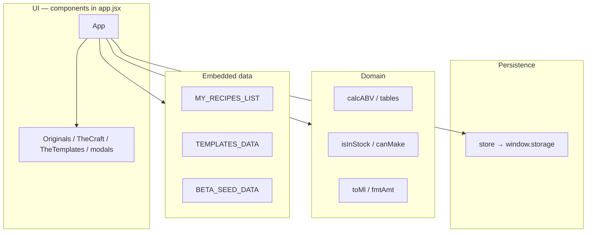

# Agent guide — Liquid Alchemy

This file routes humans and AI assistants through the repo. **The running app lives entirely in `app.jsx` today** (~7,500 lines). Do not load that file whole unless the task truly requires it.

## Product

**Liquid Alchemy** is a cocktail compendium: curated recipes, liquor-cabinet inventory, craft preparations (syrups, techniques, garnishes), family taxonomy, and bartending education. It runs as a client-only React SPA in a host that provides **`window.storage`** (e.g. Claude Artifact).

## Docs (read these first)

| Document | Use when |
|----------|----------|
| [docs/architecture.md](docs/architecture.md) | System design, persistence, domain logic |
| [docs/project-map.md](docs/project-map.md) | Line ranges and symbols inside `app.jsx` |
| [docs/refactor-plan.md](docs/refactor-plan.md) | Planned modularization (Phase 0+ ) |
| [docs/DATA-CONTRIBUTING.md](docs/DATA-CONTRIBUTING.md) | Adding or editing canonical recipes |

Root `ARCHITECTURE.md` is an older copy; prefer **`docs/architecture.md`**.

## Repository layout

```
liquid-alchemy/
├── app.jsx              # All application code (only runtime source file)
├── README.md
├── AGENTS.md            # This file
├── docs/
└── .cursorignore
```

## Task → where to look

| Intent | Open first | Line hints (approx.) |
|--------|------------|----------------------|
| Add / edit a **canonical recipe** | [docs/DATA-CONTRIBUTING.md](docs/DATA-CONTRIBUTING.md) → My Recipes block | 397–2769, list at 2660 |
| **First-run seed** / empty storage | `BETA_SEED_DATA` | 4635+ |
| **Families** curriculum (read-only) | `TEMPLATES_DATA`, `TheTemplates` | 4391–4507, 4511+ |
| **ABV / calories / skinny filter** | `ABV_TABLE`, `SUGAR_TABLE`, `calcABV` | 174–355 |
| **Can Make / inventory match** | `isInStock`, `canMake` inside `App` | ~5316–5322 |
| **Liquor cabinet** UI | `App` tab `cabinet` | ~5701+ |
| **Craft** preparations | `TheCraft`, `DEFAULT_CRAFT_ITEMS` in load | 6146+, ~4877+ |
| **Create wizard** | `Originals` | 3953+ |
| **Shopping list** | `ShoppingList` | 6873+ |
| **Import / export** | `App` header handlers | ~5484–5537 |
| **Storage adapter** | `store` | 27–52 |
| **Load / save / merge** | `App` `useEffect` load, save effects | ~4771–5300 |
| **Global styles** | `css` string | 2946–3662 |
| **Edit cocktail UI** | `EditModal` | 7073+ |
| **Dev / product notes** | `DevNotes` | 4315+ |
| **Constants** (tags, glasses, craft types) | Constants section | 54–173 |

Use [docs/project-map.md](docs/project-map.md) for the full section table and component registry.

## Persistence (`window.storage`)

| Key | Contents |
|-----|----------|
| `alchemy_cocktails` | Cocktail metadata (no inline images) |
| `alchemy_inventory` | Cabinet items |
| `alchemy_craft` | Craft items + collections |
| `alchemy_img_{id}` | Recipe illustration |
| `alchemy_myphoto_{id}` | User photo |
| `alchemy_thumb_{id}` | Grid thumbnail |

**Merge rule:** On each load, recipes in `MY_RECIPES_LIST` are injected if their `id` is not already in storage. User edits in storage win for existing ids.

## Editing rules for agents

1. **Minimize scope** — Change only what the task requires; prefer one section of `app.jsx`.
2. **Do not refactor structure** unless asked — follow [docs/refactor-plan.md](docs/refactor-plan.md).
3. **Preserve storage keys and merge semantics** unless the task includes an explicit migration.
4. **Images** — Do not embed large base64 in recipe objects for persistence; illustrations use `alchemy_img_{id}` (see DATA-CONTRIBUTING).
5. **No new runtime files** without user approval — the host may expect a single `app.jsx`.
6. **Update docs** when you change section layout or storage behavior (`project-map.md`, `architecture.md`).

## Layer diagram (logical — not separate files yet)



## Verification (manual)

There is no test runner in-repo. After code changes, sanity-check in the host:

- App loads (“Loading…” clears).
- Cocktails grid count plausible; open one recipe (lazy image load).
- Can Make filter if inventory exists.
- Families tab expands; Craft and Create tabs open.

## Phase 0 status

Documentation and indexing only. Application code remains monolithic in `app.jsx` until later refactor phases.
