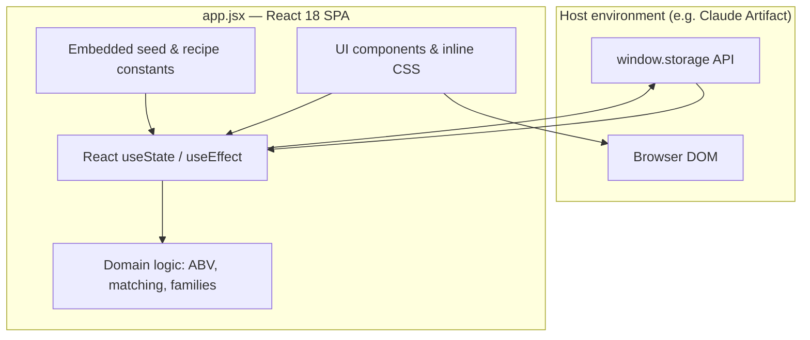
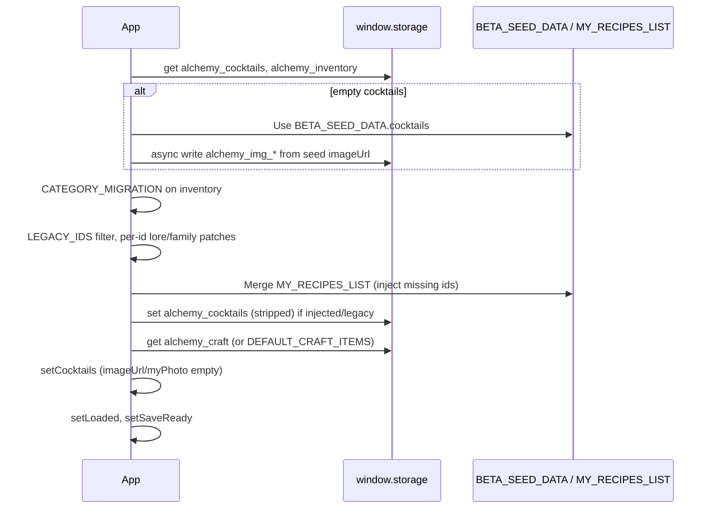
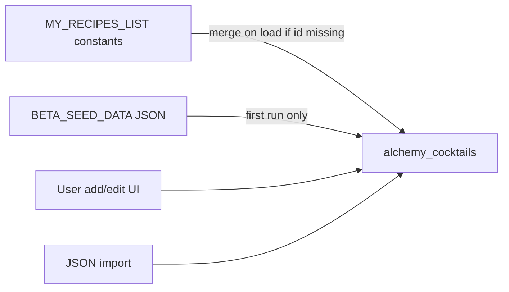

# Liquid Alchemy — Architecture

**Product:** A cocktail compendium (recipes, technique library, inventory, and bartending education).  
**Repository layout:** Single-file React application plus minimal project metadata.  
**Last documented:** June 2026 (from codebase analysis; no application code was changed).

---

## 1. Executive summary

Liquid Alchemy is a **client-only React SPA** delivered as one module (`app.jsx`, ~7,500 lines). There is no backend, build manifest (`package.json`), router, or component file tree in the repository. The app is designed to run inside an **Artifact-style host** that provides `window.storage` for durable key–value persistence.

Architecturally, the system is a **monolithic UI shell** with:

- **Three primary data domains:** cocktails, liquor-cabinet inventory, and craft preparations (including collections).
- **Embedded curriculum data:** cocktail family taxonomy (`TEMPLATES_DATA`), canonical “My Recipes” constants (`MY_RECIPES_LIST`), first-run seed (`BETA_SEED_DATA`), and reference tables (ABV/sugar).
- **Split persistence:** JSON metadata in a few keys; large binary-ish payloads (images) in per-recipe keys.

The design optimizes for **rich offline content** and **fast startup** by stripping images from in-memory cocktail records and loading them lazily.

---

## 2. System context



| Layer | Responsibility |
|--------|----------------|
| **Host** | Loads React, provides `window.storage.get/set/delete/list`, renders the artifact |
| **Application** | All product logic, UI, migrations, and backup import/export |
| **External (runtime)** | Google Fonts via CSS `@import` |

There is **no** separate API server, database, or authentication layer in this repository.

---

## 3. Repository structure

| Path | Role |
|------|------|
| `app.jsx` | Entire application: data, styles, components, default export `App` |
| `README.md` | One-line product description |
| `ARCHITECTURE.md` | This document |

**Not present:** `package.json`, tests, CI config, route definitions, or split component modules.

### 3.1 Physical organization inside `app.jsx`

The file is organized by **comment section banners** (`/* ─── … ─── */`), in roughly this order:

1. App logging utilities (`appLog`, `useAppLog`)
2. Embedded assets (logo, placeholder JPEGs as data URLs)
3. Storage adapter (`store`)
4. Constants, factories, reference tables
5. **My Recipes** — large inline recipe objects (~lines 397–2770)
6. Helpers (units, perishability, `newCocktail`)
7. Presentational components and **inline CSS string** (`css`)
8. Feature modules: `Originals`, `DevNotes`, `TheTemplates`, `TheCraft`, modals, `ShoppingList`, `PrintCard`
9. `BETA_SEED_DATA` — JSON blob for first-time users
10. **`export default function App()`** — root state, load/save, navigation, cocktails tab UI
11. Remaining modals tied to craft/cocktail editing

Most of the file’s **byte size** comes from base64 images and the `BETA_SEED_DATA` JSON string, not from control-flow complexity.

---

## 4. Application architecture

### 4.1 Root component (`App`)

`App` is the **single source of truth** for:

- Active tab (`tab`)
- Collections: `cocktails`, `inventory`, `craftItems`
- Load gate: `loaded`, `saveReady`
- Cocktail list UX: search, filters, sort, shuffle, detail view, edit/print modals
- Cross-tab navigation: `craftDeepLink`, `returnCocktailId`, `filterFamily`

Child feature areas are **function components** that receive state and setters as props (no Context API, no external store).

### 4.2 Navigation model

Tab state is a string key; the header renders seven primary areas plus global actions:

| Tab key | Label | Component / content |
|---------|--------|-------------------|
| `cocktails` | Cocktails | Inline in `App` (grid, filters, view modal) |
| `cabinet` | Liquor Cabinet | Inline in `App` |
| `craft` | Craft | `TheCraft` |
| `templates` | Families | `TheTemplates` |
| `originals` | Create | `Originals` |
| `shopping` | Shopping List | `ShoppingList` |
| `dev` | Dev | `DevNotes` (product/design notes for beta testers) |

**Global header actions:** Export backup, Import JSON, “Our Philosophy” modal.

There is no URL routing; deep linking is limited to in-app state (e.g. opening a craft item from a cocktail’s linked techniques).

### 4.3 Component dependency (simplified)

```mermaid
flowchart TD
  App["App (default export)"]
  App --> TheCraft
  App --> TheTemplates
  App --> Originals
  App --> ShoppingList
  App --> DevNotes
  App --> EditModal
  App --> PrintCard
  App --> CocktailPhoto
  App --> CharTag
  App --> Stars
  App --> BubbleProfile
  TheCraft --> CraftEditModal
  TheCraft --> CollectionEditModal
  TheTemplates --> TEMPLATES_DATA
  Originals --> detectFamily / inventory hints
  EditModal --> IngRow
  App --> InventoryItem
```

---

## 5. Data model

### 5.1 Cocktail

Created via `newCocktail()`; persisted **without** `imageUrl`, `myPhoto`, or `_thumb` in `alchemy_cocktails`.

| Field | Purpose |
|--------|---------|
| `id` | Stable string slug or timestamp id |
| `name`, `baseSpirit`, `glass`, `occasion`, `season`, `difficulty`, `serveStyle` | Metadata & filters |
| `family`, `subFamily` | Taxonomy (aligned with Families tab) |
| `tags` | Character tags from `CHAR_TAGS` |
| `sliders` | Numeric profile (`CHAR_SLIDERS` keys 0–10) |
| `ingredients[]` | `{ name, amount, unit }` |
| `instructions`, `notes`, `riffs`, `tastingNotes`, `lore` | Prose fields |
| `rating` | 1–5 stars |
| `wantToTry`, `tried`, `favorite` | User workflow flags |
| `obscura` | Curated “hidden gem” flag for filter |
| `craftLinks[]` | IDs of linked craft preparations |
| `sourceUrl` | External reference |
| `addedAt` | Sort key (timestamp) |

**Runtime-only / side storage:** `imageUrl` (illustration), `myPhoto` (user photo), `_thumb` (20×20 JPEG data URL for grid performance).

### 5.2 Inventory item

| Field | Purpose |
|--------|---------|
| `name` | Display & matching key |
| `inStock` | Boolean |
| `category` | One of `INV_CATEGORIES` |
| `spiritType` | When category is Spirits |
| `tags` | Comma-separated aliases for fuzzy ingredient matching |

### 5.3 Craft item

Two shapes share one array (`alchemy_craft`):

**Collection** (`isCollection: true`):

- `id`, `name`, `description`, `childIds[]`, `type: "Collection"`

**Preparation** (`isCollection: false`):

- `id`, `name`, `type` (from `CRAFT_TYPES`), `ingredients`, `instructions` or `steps[]`, `yield`, `difficulty`, `tags`, `collectionIds[]`, `showInline`, `photo`, `notes`, `description`

### 5.4 Templates (read-only curriculum)

`TEMPLATES_DATA` is a **static tree**: 11 root families → subfamilies → `appIds[]` linking to cocktail `id`s in the live collection. It does not sync automatically with user edits; it is editorial content.

---

## 6. Persistence architecture

### 6.1 Storage adapter

```text
store.get(k)     → JSON.parse(result.value) or raw string
store.set(k, v)  → JSON.stringify for objects
store.del(k)
store.listKeys(prefix)
```

All persistence assumes an async host API; failures are generally swallowed with `console.error` on write.

### 6.2 Key schema

| Key | Contents |
|-----|----------|
| `alchemy_cocktails` | Array of cocktail metadata (images stripped) |
| `alchemy_inventory` | Inventory array |
| `alchemy_craft` | Craft items + collections |
| `alchemy_img_{id}` | Full recipe illustration (often data URL) |
| `alchemy_myphoto_{id}` | User-uploaded photo |
| `alchemy_thumb_{id}` | Tiny JPEG thumbnail for grid |

### 6.3 Load pipeline (startup)



**Design intent:** Startup never loads full images into the cocktail array; thumbnails may be generated in a background pass after `loaded`.

### 6.4 Save pipeline

- `saveReady` prevents `useEffect` saves during initial hydration.
- Any change to `cocktails`, `inventory`, or `craftItems` triggers `store.set` for the corresponding aggregate key (cocktails stripped of image fields).
- Image writes happen **at point of action** (`saveEdit`, import, seed) via dedicated keys.

### 6.5 Backup import / export

- **Export:** Iterates cocktails, pulls `alchemy_img_*` / `alchemy_myphoto_*` with timeouts, builds JSON `{ cocktails, inventory }`, shows copy-paste modal (no download API).
- **Import:** Parses JSON; restores images to per-id keys; merges cocktails by `id` (update existing, append new); replaces inventory if provided.

Craft data is **not** included in export/import in the current implementation.

---

## 7. Domain logic

### 7.1 Cocktail families (two systems)

1. **`COCKTAIL_FAMILIES` / `getCocktailFamily(id)`** — Legacy map from cocktail id → coarse family name (used for `filterFamily` fallback).
2. **`family` / `subFamily` on each recipe** — Primary taxonomy, aligned with `TEMPLATES_DATA` and load-time migrations.

### 7.2 ABV, calories, and “skinny”

- `ABV_TABLE` and `SUGAR_TABLE` provide lookup by normalized ingredient name (substring fallback).
- `calcABV(ingredients)` converts amounts to ml, estimates ABV with 1.22 dilution factor, calories (alcohol + sugar), flags `skinny` if ≤150 cal.
- Filters: `filterSkinny`, `filterLowABV` (<10%), `filterZeroProof` (0% ABV).

### 7.3 Inventory matching (`isInStock`)

Fuzzy matching for “Can Make” and shopping list:

- Normalize strings (lowercase, strip punctuation)
- Stem plural endings
- Ignore filler words (`fresh`, `juice`, …)
- **Word-set inclusion:** all words from the smaller set must appear in the larger set
- Also match against inventory item **tags**

This is heuristic, not a structured ingredient ontology.

### 7.4 Character profile

- **Tags:** discrete labels (`CHAR_TAGS`) with display colors (`CHAR_META`).
- **Sliders:** 0–10 axes (`CHAR_SLIDERS`); `TAG_SLIDER_MAP` connects tags to sliders for sorting tag chips by intensity.
- **BubbleProfile:** circle-packing visualization of slider weights.

### 7.5 Originals wizard (`Originals`)

Multi-step questionnaire (spirit → flavor → character → texture → serve) → `detectFamily()` rules → suggested starting spec and inventory-aware ingredient hints. Can append a generated cocktail to the collection via `setCocktails`.

### 7.6 Craft ↔ cocktail linking

- Explicit: `cocktail.craftLinks` array of craft ids.
- Implicit: `TheCraft.usedIn()` matches craft item names to ingredient names via normalized word overlap.

---

## 8. Media handling

| Concern | Approach |
|---------|----------|
| Illustration | Stored in `alchemy_img_{id}`; lazy-loaded on view/edit |
| User photo | Upload → canvas resize max 800px → JPEG 0.82 → `alchemy_myphoto_{id}` |
| Grid performance | `makeTinyThumb()` → 20×20 JPEG → `alchemy_thumb_{id}`; background generation after load |
| Placeholders | Family-based placeholder images; emoji fallback in `CocktailPhoto` |
| Embedded branding | `ALCHEMY_LOGO`, `COCKTAIL_PLACEHOLDER` as inline base64 in source |

Storage operations use **timeouts** (2–3s) to avoid hanging the UI if the host is slow.

---

## 9. UI and styling

- **CSS:** One template literal `css` injected via `<style>{css}</style>`; CSS variables for parchment/amber palette (`--bg`, `--accent`, etc.).
- **Typography:** Cormorant Garamond, Mrs Saint Delafield, Jost, Nunito (Google Fonts).
- **Layout:** Header + tab nav + `<main>`; modals use `.overlay` / `.modal`.
- **State styling:** Mostly inline `style={{}}` for one-off layouts; shared patterns use class names from `css`.

No CSS-in-JS library, Tailwind, or component library.

---

## 10. Content layers (how recipes enter the system)



| Source | When applied |
|--------|----------------|
| `BETA_SEED_DATA` | First launch when `alchemy_cocktails` is empty |
| `MY_RECIPES_LIST` | Every load: injects recipes whose `id` is not already stored |
| Load-time patches | Per-`id` fixes for `family`, `lore`, `notes` (migration without version numbers) |
| `DEFAULT_INVENTORY` / `DEFAULT_CRAFT_ITEMS` | Fallback when storage empty or craft missing |

Developers add permanent recipes by defining a constant in the **My Recipes** section and appending it to `MY_RECIPES_LIST` (documented in-file).

---

## 11. Observability

- **`appLog(msg)`** — Ring buffer (50 entries) with listener pattern; **`useAppLog` hook exists but no tab currently renders the log** (comment references a “Debug tab”; `dev` shows `DevNotes` only).
- **Console** — `console.error` on storage failures and load errors.

---

## 12. Cross-cutting concerns

| Concern | Implementation |
|---------|----------------|
| **Concurrency** | Single-threaded UI; async I/O with timeouts; thumbnail pass yields 50ms between cocktails |
| **Migrations** | Ad hoc: `CATEGORY_MIGRATION`, `LEGACY_IDS`, inline `if (x.id === …)` transforms |
| **Internationalization** | None (English UI and content) |
| **Security** | No auth; import trusts user-selected JSON; XSS risk mitigated by React default escaping (user content in text fields) |
| **Accessibility** | Partial (semantic buttons; mixed inline controls) |

---

## 13. Feature module reference

| Module | Responsibility |
|--------|----------------|
| **Cocktails tab** | Grid, filters, sort, detail modal, batch scaling (`batch`), metric toggle (`useMetric`), print |
| **Liquor Cabinet** | CRUD inventory by category; drives Can Make / shopping |
| **Craft** | Collections + preparations CRUD, search, deep link from cocktails |
| **Families** | Expandable curriculum from `TEMPLATES_DATA`; jump to filtered cocktails |
| **Create (Originals)** | Guided recipe ideation |
| **Shopping List** | Aggregate missing ingredients for selected recipes |
| **Dev** | Static `DevNotes` (philosophy, brand, roadmap) |
| **EditModal** | Full cocktail editor with autocomplete ingredients, craft links, photo upload |
| **PrintCard** | Print-oriented layout |

---

## 14. Design tradeoffs and implications

**Strengths**

- Zero deployment complexity in-repo; entire product ships as one artifact.
- Large curated dataset travels with the code.
- Image split keeps JSON metadata small and startup predictable.

**Constraints**

- Monolith is hard to test, review, and split across contributors.
- No schema versioning for storage migrations.
- Export omits craft library; re-hosting requires the same `window.storage` contract.
- Ingredient matching and ABV are approximate, not spec-grade.
- File size (~1.2 MB) is dominated by embedded assets and seed JSON, affecting parse/load in dev tools.

**Likely evolution paths** (not implemented): extract modules, add `package.json` + Vite, formal migration version, download-based export, craft in backup, wire up debug log UI, externalize images to CDN/storage.

---

## 15. Glossary

| Term | Meaning in this app |
|------|---------------------|
| **Compendium** | Curated set of worthwhile recipes, not an exhaustive database |
| **Obscura** | Flag for lesser-known, high-quality recipes |
| **Craft** | House preparations: syrups, techniques, garnishes, etc. |
| **Families** | Structural cocktail taxonomy (11 root families in UI) |
| **Daisy / Sour / etc.** | Subfamily templates within the education layer |

---

## Appendix A: Constants index (representative)

- `CHAR_TAGS`, `CHAR_META`, `CHAR_SLIDERS`, `TAG_SLIDER_MAP`
- `SERVE_STYLES`, `SPIRIT_OPTIONS`, `GLASS_OPTIONS`
- `CRAFT_TYPES`, `CRAFT_TAGS`
- `COCKTAIL_FAMILIES`, `COCKTAIL_FAMILY_DESCRIPTIONS`
- `ABV_TABLE`, `SUGAR_TABLE`
- `INV_CATEGORIES`, `SPIRIT_TYPES`, `SPIRIT_HIERARCHY`
- `DEFAULT_SLIDERS`, `DEFAULT_INVENTORY`
- `TEMPLATES_DATA`, `MY_RECIPES_LIST`, `BETA_SEED_DATA`

## Appendix B: Function components index

`CocktailPhoto`, `Stars`, `CharTag`, `BubbleProfile`, `CharSliders`, `CharSliderEdit`, `InventoryItem`, `IngRow`, `Originals`, `DevNotes`, `TheTemplates`, `TheCraft`, `CollectionEditModal`, `CraftEditModal`, `ShoppingList`, `PrintCard`, `EditModal`, and **`App`** (default export).
