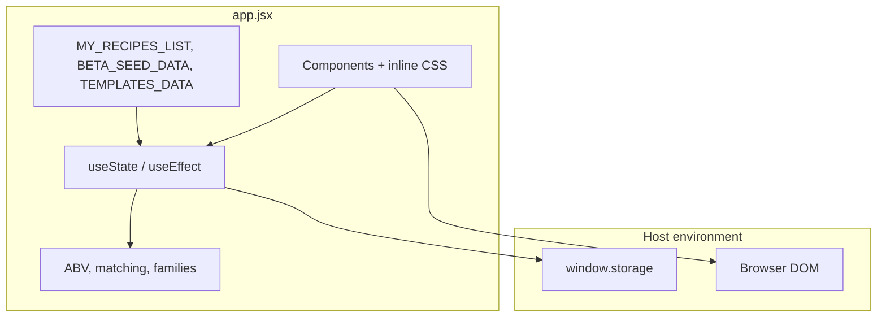
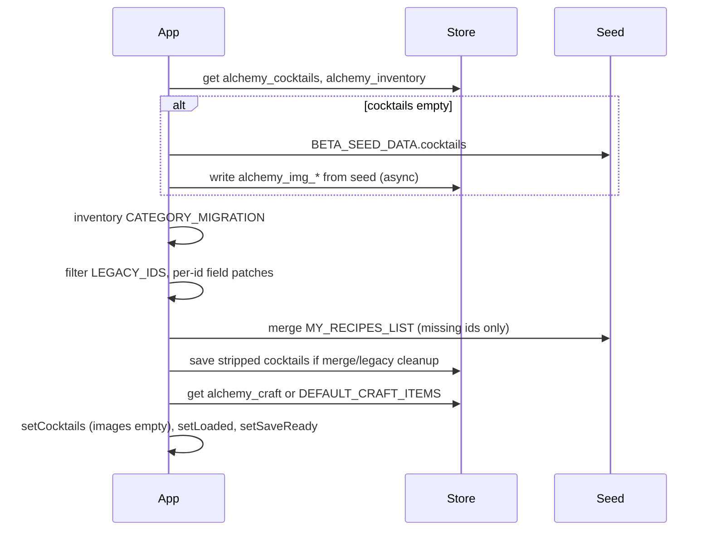
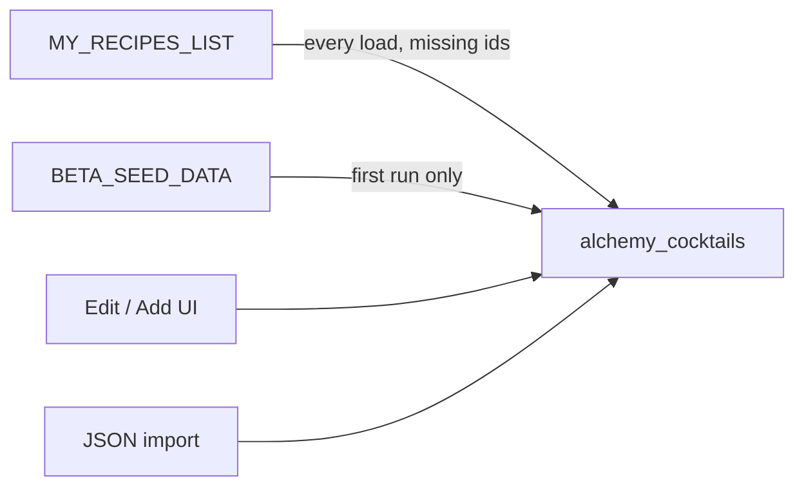

# Liquid Alchemy — Architecture

**Product:** A cocktail compendium (recipes, technique library, inventory, and bartending education).  
**Codebase:** Single-file React application (`app.jsx`, 7,499 lines).  
**Documented:** June 2026 (analysis only; application code unchanged).

---

## 1. Executive summary

Liquid Alchemy is a **client-only React SPA** with no backend, `package.json`, router, or multi-file component tree in this repository. It targets a **host environment** (e.g. Claude Artifact) that exposes **`window.storage`** for async key–value persistence.

The architecture is a **monolithic UI shell** around three data domains:

| Domain | Purpose |
|--------|---------|
| **Cocktails** | Curated recipe collection with metadata, prose, and user flags |
| **Inventory** | Liquor cabinet / pantry stock for “can make” and shopping |
| **Craft** | House preparations, techniques, tools, and grouped collections |

Cross-cutting layers:

- **Embedded curriculum:** `TEMPLATES_DATA` (11 cocktail families), `MY_RECIPES_LIST` (source-of-truth recipe constants), `BETA_SEED_DATA` (first-run seed JSON).
- **Reference data:** `ABV_TABLE`, `SUGAR_TABLE` for estimated ABV and calories.
- **Split persistence:** Metadata in aggregate keys; images in per-cocktail keys; lazy load at view time.

Startup is optimized by **keeping images out of the in-memory cocktail array** until a recipe is opened or exported.

---

## 2. System context



| Layer | Responsibility |
|--------|----------------|
| **Host** | React runtime, `window.storage`, artifact chrome |
| **Application** | All product logic, UI, migrations, import/export |
| **External** | Google Fonts (`@import` in inline CSS) |

There is **no** API server, database, or authentication in-repo.

---

## 3. Repository layout

```
liquid-alchemy/
├── app.jsx              # Entire application
├── README.md            # One-line description
├── ARCHITECTURE.md      # Earlier root-level doc (optional; superseded by docs/)
└── docs/
    ├── architecture.md  # This file
    └── project-map.md   # Line-level map of app.jsx
```

**Not in repo:** `package.json`, tests, CI, environment config, split `src/` tree.

---

## 4. Runtime model

### 4.1 Entry point

- **Default export:** `App` (line 4637).
- **Styles:** Injected as `<style>{css}</style>` where `css` is a template literal (~2946–3662).
- **Loading gate:** Until `loaded` is true, UI shows a centered “Loading…” placeholder.

### 4.2 Navigation

Tab state is a string (`tab`); no URL router.

| `tab` value | UI label | Implementation |
|-------------|----------|----------------|
| `cocktails` | Cocktails | Inline in `App` |
| `cabinet` | Liquor Cabinet | Inline in `App` |
| `craft` | Craft | `TheCraft` |
| `templates` | Families | `TheTemplates` |
| `originals` | Create | `Originals` |
| `shopping` | Shopping List | `ShoppingList` |
| `dev` | Dev | `DevNotes` |

**Header utilities:** Export backup (JSON modal), Import (file → merge), Philosophy modal.

**Cross-tab linking:** `craftDeepLink` + `returnCocktailId` open Craft from a cocktail and return to detail view.

### 4.3 State ownership

All authoritative state lives in `App`:

- `cocktails`, `inventory`, `craftItems`
- Filters, search, sort, `viewCocktailId`, `editCocktail`, modals
- `loaded`, `saveReady` (persistence guards)

Child components are **presentational + local UI state** only (expanded sections, form drafts, search boxes).

No React Context, Redux, or external store.

---

## 5. Persistence

### 5.1 Storage adapter (`store`, lines 27–52)

Wraps `window.storage` with JSON parse/stringify and silent failure on read/delete.

### 5.2 Key schema

| Key | Content |
|-----|---------|
| `alchemy_cocktails` | Cocktail metadata array (**no** `imageUrl`, `myPhoto`, `_thumb`) |
| `alchemy_inventory` | Inventory items |
| `alchemy_craft` | Craft preparations + collections |
| `alchemy_img_{id}` | Recipe illustration (often data URL) |
| `alchemy_myphoto_{id}` | User-uploaded photo |
| `alchemy_thumb_{id}` | 20×20 JPEG thumbnail for grid |

### 5.3 Load sequence (on mount)



### 5.4 Save sequence

- `saveReady` blocks writes during hydration.
- `useEffect` on `cocktails` / `inventory` / `craftItems` writes aggregate keys (cocktails stripped).
- Images saved in `saveEdit`, import, and seed paths via per-id keys.
- Background pass generates missing thumbnails after `loaded` (`makeTinyThumb`, 3s timeouts).

### 5.5 Backup

| Direction | Behavior |
|-----------|----------|
| **Export** | Pull all images per cocktail → JSON `{ cocktails, inventory }` → copy modal |
| **Import** | Parse JSON → restore image keys → merge cocktails by `id` → replace inventory |

**Gap:** Craft library is not included in export/import today.

---

## 6. Data models

### 6.1 Cocktail (`newCocktail`, line 2896)

**Persisted fields (typical):** `id`, `name`, `baseSpirit`, `glass`, `occasion`, `season`, `difficulty`, `serveStyle`, `family`, `subFamily`, `tags[]`, `sliders{}`, `ingredients[]`, `instructions`, `notes`, `riffs`, `tastingNotes`, `lore`, `rating`, `wantToTry`, `tried`, `favorite`, `obscura`, `craftLinks[]`, `sourceUrl`, `addedAt`.

**Workbook-only / export-preserved (optional):** `citations` — from `Lore.citations` in the canonical workbook; included in workbook→JSON export when populated; no app UI yet. Import merge preserves unknown fields on cocktail objects.

**Runtime / side storage:** `imageUrl`, `myPhoto`, `_thumb`.

### 6.2 Inventory item

`name`, `inStock`, `category` (`INV_CATEGORIES`), optional `spiritType`, optional `tags[]` for fuzzy matching.

### 6.3 Craft

- **Collection:** `isCollection: true`, `childIds[]`, `description`
- **Preparation:** `type` (`CRAFT_TYPES`), `ingredients`, `instructions` or `steps`, `collectionIds`, `showInline`, etc.

### 6.4 Templates (read-only)

`TEMPLATES_DATA`: 11 root families → subfamilies → `appIds[]` linking to cocktail `id`s. Editorial; not auto-synced with user edits.

---

## 7. Content ingestion



| Source | When |
|--------|------|
| `BETA_SEED_DATA` | Empty `alchemy_cocktails` on first launch |
| `MY_RECIPES_LIST` | Each load: inject recipes whose `id` is absent |
| Load patches | Inline `if (x.id === …)` updates for `family`, `lore`, `notes` |
| `DEFAULT_INVENTORY` / `DEFAULT_CRAFT_ITEMS` | Fallback when storage empty |

Developers add permanent recipes in the **My Recipes** block (lines 397–2769) and register constants in `MY_RECIPES_LIST`.

---

## 8. Domain logic

### 8.1 Families (dual system)

1. **`COCKTAIL_FAMILIES` / `getCocktailFamily(id)`** — Legacy id → family map for filters.
2. **`family` / `subFamily` on records** — Primary taxonomy; aligned with Families tab.

### 8.2 ABV and nutrition estimates

`lookupABV` / `lookupSugar` → `calcABV(ingredients)`:

- Converts oz, ml, tsp, tbsp, dash, etc. to ml
- Applies 1.22 dilution factor for served ABV
- Calories: alcohol (7 cal/g) + sugar (4 cal/g)
- `skinny`: ≤150 cal; filters: skinny, low ABV (<10%), zero proof

### 8.3 Inventory matching (`isInStock`)

Heuristic word-set matching with stemming, filler-word removal, and inventory tag aliases. Powers **Can Make**, card hints, and shopping list.

### 8.4 Character profile

- Tags: `CHAR_TAGS` + `CHAR_META` colors
- Sliders: 0–10 on `CHAR_SLIDERS` axes
- `sortTags` orders tags by slider strength; `BubbleProfile` visualizes weights

### 8.5 Originals wizard

`Originals`: multi-step builder → `detectFamily()` → starter spec + inventory suggestions → optional append to `cocktails`.

### 8.6 Craft linkage

- Explicit: `cocktail.craftLinks`
- Implicit: `TheCraft.usedIn()` matches craft names to ingredient names

---

## 9. Feature modules (summary)

| Module | Role |
|--------|------|
| **Cocktails tab** | Grid, rich filters, sort/shuffle, detail modal, batch scale, metric units, print |
| **Liquor Cabinet** | Categorized inventory CRUD |
| **Craft** | Collections + preparations, search, deep link |
| **Families** | `TEMPLATES_DATA` browser → filter cocktails |
| **Create** | Originals ideation flow |
| **Shopping List** | Missing ingredients for selected recipes |
| **Dev** | `DevNotes` — product philosophy and beta notes |
| **EditModal** | Full recipe editor, photos, craft links |
| **PrintCard** | Print layout |

---

## 10. Media pipeline

| Asset | Storage | Load timing |
|-------|---------|-------------|
| Illustration | `alchemy_img_{id}` | Lazy on view/edit |
| User photo | `alchemy_myphoto_{id}` | Lazy; upload resized to max 800px JPEG |
| Thumbnail | `alchemy_thumb_{id}` | Background after load; 20×20 JPEG |
| Branding | `ALCHEMY_LOGO`, placeholders in source | Immediate (base64) |

Storage calls use **Promise timeouts** (2–3s) to avoid UI hangs.

---

## 11. UI and styling

- Single `css` string: CSS variables, layout, cards, modals, print styles
- Fonts: Cormorant Garamond, Mrs Saint Delafield, Jost, Nunito
- Mixed class-based and inline styles
- No component library or CSS framework

---

## 12. Observability

- `appLog` / `useAppLog`: in-memory ring buffer (50 entries); **hook is not wired to any tab** (comment mentions Debug; `dev` shows `DevNotes` only)
- `console.error` on load/save failures

---

## 13. Design tradeoffs

**Strengths:** Self-contained artifact; rich embedded curriculum; fast startup via image stripping; offline-first with host storage.

**Constraints:** Monolith maintainability; ad hoc migrations (no schema version); approximate ABV/matching; large `app.jsx` parse weight; export omits craft; function components defined after `App` rely on hoisting.

**Likely evolutions:** Module split, build tooling, versioned migrations, craft in backup, debug log UI, externalized images.

---

## 14. Glossary

| Term | In-app meaning |
|------|----------------|
| **Compendium** | Curated worthwhile recipes, not exhaustive DB |
| **Obscura** | Lesser-known standout recipes (`obscura: true`) |
| **Craft** | Syrups, techniques, garnishes, tools, collections |
| **Families** | 11-root structural taxonomy (education layer) |

---

## Appendix: Key symbols

| Symbol | Location (approx.) |
|--------|---------------------|
| `store` | 27–52 |
| `MY_RECIPES_LIST` | 2660–2769 |
| `TEMPLATES_DATA` | 4391–4507 |
| `BETA_SEED_DATA` | 4635+ |
| `App` | 4637–6143 |
