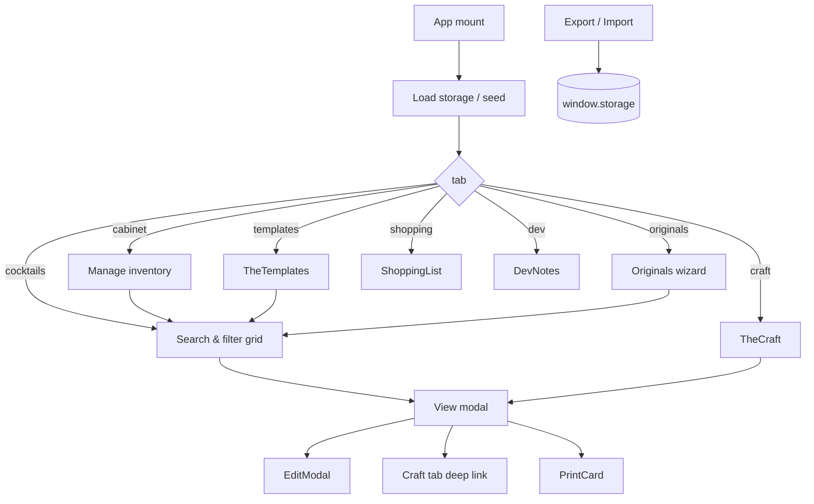

# Liquid Alchemy — Project Map

Quick orientation to the repository and the internal layout of `app.jsx`.  
Line numbers refer to the current file (7,499 lines). Application code is not modified by this document.

---

## 1. Repository tree

```
liquid-alchemy/
├── .git/
├── app.jsx                 # 100% of application logic (~1.2 MB on disk)
├── README.md               # "# liquid-alchemy — a cocktail compendium"
├── ARCHITECTURE.md         # Root-level architecture (prior pass)
└── docs/
    ├── architecture.md     # System design (this docs set)
    └── project-map.md      # This file
```

| Artifact | Size / scale |
|----------|----------------|
| `app.jsx` | 7,499 lines; bulk = base64 images + `BETA_SEED_DATA` JSON |
| Recipe constants | ~105 entries in `MY_RECIPES_LIST` |
| React components | 20 function components + `App` |
| npm / build | None |

---

## 2. `app.jsx` section map

Sections follow banner comments `/* ─── … ─── */`.

| Lines (approx.) | Section | Contents |
|-----------------|---------|----------|
| 1 | Imports | `react` — `useState`, `useEffect`, `useRef` |
| 3–19 | App log | `appLog`, `useAppLog`, listener pattern |
| 21–25 | Assets | `ALCHEMY_LOGO`, `COCKTAIL_PLACEHOLDER` (data URLs) |
| 27–52 | Storage | `store` adapter → `window.storage` |
| 54–173 | Constants | Tags, serve styles, craft types, families, factories |
| 174–395 | ABV / sugar | `ABV_TABLE`, `SUGAR_TABLE`, `lookup*`, `calcABV`, `sortTags` |
| 397–2770 | **My Recipes** | Inline `const RECIPE_NAME = { … }` objects |
| 2771 | End My Recipes | — |
| 2773–2852 | Inventory defaults | `SPIRIT_HIERARCHY`, `DEFAULT_INVENTORY` |
| 2854–2901 | Helpers | `isPerishable`, `toMl`, `toOz`, `fmtAmt`, `newCocktail` |
| 2903–2944 | CocktailPhoto | Thumbnail / emoji placeholder |
| 2946–3662 | **CSS** | Full app stylesheet (`css` template literal) |
| 3663–3941 | UI primitives | Stars, CharTag, BubbleProfile, sliders, InventoryItem, IngRow |
| 3943–3950 | Placeholders | `getPlaceholderImage(c)` by family |
| 3952–4312 | Originals | Create wizard (`Originals`) |
| 4314–4387 | Dev Notes | `DevNotes` static copy |
| 4390–4507 | Templates data | `TEMPLATES_DATA` (11 families) |
| 4510–4632 | Templates UI | `TheTemplates` |
| 4634–4636 | Beta seed | Start of `BETA_SEED_DATA` (large JSON line(s)) |
| **4637–6143** | **`App`** | Root component, load/save, all main tabs |
| 6145–6588 | The Craft | `TheCraft` |
| 6590–6691 | Collection modal | `CollectionEditModal` |
| 6692–6870 | Craft modal | `CraftEditModal` |
| 6872–6970 | Shopping | `ShoppingList` |
| 6972–7070 | Print | `PrintCard` |
| 7072–7499 | Edit modal | `EditModal` |

> **Note:** `EditModal`, `PrintCard`, and other components are **defined after** `App` but are valid because `function` declarations are hoisted in JavaScript.

---

## 3. Component registry

| Component | Line | Props / usage |
|-----------|------|----------------|
| `appLog` | 6 | Side-effect logger (not a component) |
| `useAppLog` | 12 | Hook — **unused in JSX** |
| `newCollection` | 85 | Factory |
| `newCraftItem` | 96 | Factory |
| `getCocktailFamily` | 143 | `id` → family string |
| `lookupABV` / `lookupSugar` / `calcABV` | 301–355 | Domain |
| `CocktailPhoto` | 2904 | `{ cocktail, size }` |
| `Stars` | 3664 | Rating input/display |
| `CharTag` | 3679 | Flavor tag chip |
| `BubbleProfile` | 3729 | Slider visualization |
| `CharSliders` / `CharSliderEdit` | 3775+ | View / edit sliders |
| `InventoryItem` | 3820 | Cabinet row |
| `IngRow` | 3889 | Ingredient autocomplete row |
| `getPlaceholderImage` | 3947 | Family placeholder URL |
| `Originals` | 3953 | `{ cocktails, setCocktails, inventory }` |
| `DevNotes` | 4315 | None |
| `TheTemplates` | 4511 | `{ cocktails, setTab, setViewCocktailId, setFilterFamily }` |
| **`App`** | **4637** | **Default export** |
| `TheCraft` | 6146 | craft + cocktails + deep link |
| `CollectionEditModal` | 6591 | Collection CRUD |
| `CraftEditModal` | 6693 | Preparation CRUD |
| `ShoppingList` | 6873 | `{ cocktails, inventory }` |
| `PrintCard` | 6973 | `{ cocktail, onClose }` |
| `EditModal` | 7073 | Full editor |

---

## 4. `App` internal map (4637–6143)

### 4.1 State clusters

| Cluster | Examples |
|---------|----------|
| **Navigation** | `tab`, `craftDeepLink`, `returnCocktailId` |
| **Data** | `cocktails`, `inventory`, `craftItems`, `loaded`, `saveReady` |
| **Cocktail UX** | `search`, `activeTags`, filters (`filterCanMake`, `filterObscura`, …), `sortBy`, `shuffleOrder` |
| **Detail / edit** | `viewCocktailId`, `editCocktail`, `isNew`, `printCocktail`, `batch`, `useMetric` |
| **Cabinet** | `invInput`, `invCategory`, `invSpiritType`, `invTags` |
| **Backup** | `exportData`, `exporting` |
| **UI chrome** | `showPhilosophy`, `profileExpanded` |

### 4.2 Effects (persistence & media)

| Concern | Trigger |
|---------|---------|
| Initial load | `useEffect([])` → storage + merge + `setSaveReady` |
| Save cocktails | `cocktails` + `loaded` + `saveReady` |
| Save inventory / craft | same guards |
| Thumbnail backfill | `loaded`, once per session |
| Lazy image load | `viewCocktailId`, `editCocktail.id` |

### 4.3 Tab → render map (inside `App` return)

| `tab ===` | ~location | Renders |
|-----------|-----------|---------|
| `cocktails` | ~5545+ | Grid, filters, view modal, edit trigger |
| `cabinet` | ~5701+ | Inventory sections by `INV_CATEGORIES` |
| `craft` | ~5765 | `<TheCraft … />` |
| `templates` | ~5768 | `<TheTemplates … />` |
| `originals` | ~5771 | `<Originals … />` |
| `shopping` | ~5772 | `<ShoppingList … />` |
| `dev` | ~5769 | `<DevNotes />` |

**Modals/overlays in `App`:** view cocktail, philosophy, export textarea, `EditModal`, `PrintCard`.

### 4.4 Derived data in `App`

| Name | Purpose |
|------|---------|
| `isInStock` | Fuzzy match ingredient → inventory |
| `canMake` | All ingredients in stock |
| `filtered` / `sorted` | Search + filter pipeline |
| `ingredientNames` | Autocomplete union (recipes + inventory) |
| `saveEdit` | Persist cocktail + image keys |

---

## 5. Storage key map

```
alchemy_cocktails          →  Cocktail[] (metadata only)
alchemy_inventory          →  InventoryItem[]
alchemy_craft              →  (Collection | Preparation)[]

alchemy_img_{cocktailId}   →  string (data URL or URL)
alchemy_myphoto_{cocktailId} → string
alchemy_thumb_{cocktailId} → string (tiny JPEG data URL)
```

---

## 6. Constants & data blobs

| Symbol | Line | Role |
|--------|------|------|
| `CHAR_TAGS` | 55 | Filterable flavor tags |
| `COCKTAIL_FAMILIES` | 109 | Legacy id lists per family name |
| `ABV_TABLE` / `SUGAR_TABLE` | 175+ | Ingredient lookups |
| `SPIRIT_OPTIONS`, `GLASS_OPTIONS` | ~372 | Form enums |
| `OCCASION_OPTIONS`, `SEASON_OPTIONS`, `DIFFICULTY_OPTIONS` | 374–376 | Form enums |
| `DEFAULT_INVENTORY` | 2789 | Fallback cabinet |
| `MY_RECIPES_LIST` | 2660 | Merge list on every load |
| `TEMPLATES_DATA` | 4391 | Families curriculum |
| `BETA_SEED_DATA` | 4635 | First-run seed |
| `DEFAULT_CRAFT_ITEMS` | ~4943+ (inside load) | Fallback craft library |

---

## 7. User flow map



---

## 8. Filter & sort reference (Cocktails tab)

**Filters:** character tags (multi), Can Make, Inventory hints, Want to Try, Tried, Favorites, Obscura, Skinny, Low ABV, Zero Proof, serve / occasion / season / difficulty, family.

**Sort keys:** `added`, `alpha`, `rating`, `spirit`, `instock`, `favorite`, `tried`, plus shuffle.

**Search:** name, spirit, ingredients, tags, lore, notes, riffs (normalized).

---

## 9. External dependencies (runtime)

| Dependency | How loaded |
|------------|------------|
| React 18 | Host / CDN (not in repo) |
| Google Fonts | `@import` in `css` |
| `window.storage` | Host-provided API |

---

## 10. Where to change what

| Goal | Where to look |
|------|----------------|
| Add a permanent recipe | My Recipes block + `MY_RECIPES_LIST` |
| Change first-run collection | `BETA_SEED_DATA` |
| Family education copy | `TEMPLATES_DATA` |
| New craft default | `DEFAULT_CRAFT_ITEMS` in load `useEffect` |
| New filter or tab | `App` state + header nav + main conditional |
| Ingredient ABV | `ABV_TABLE` |
| Storage format | `store` + load/save effects in `App` |
| Global styles | `css` string |
| Brand / beta copy | `DevNotes` |

---

## 11. Related docs

- **[architecture.md](./architecture.md)** — System design, persistence, domain logic, tradeoffs.
