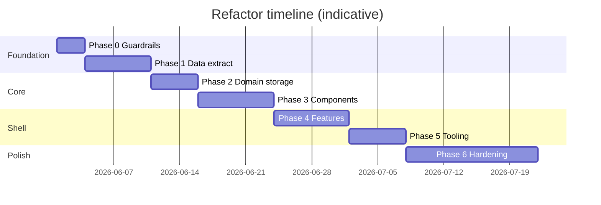

# Liquid Alchemy — Phased Refactor Plan

**Status:** Planning only — no implementation started.  
**Goals:** Improve human maintainability and make the codebase workable for AI assistants (smaller context windows, clearer boundaries).  
**Constraint:** Preserve current product behavior and Artifact/`window.storage` compatibility unless a phase explicitly targets a host migration.

**Related docs:** [architecture.md](./architecture.md), [project-map.md](./project-map.md).

---

## 1. Why refactor

### 1.1 Current pain points

| Issue | Impact on humans | Impact on AI |
|-------|------------------|--------------|
| Single `app.jsx` (~7,500 lines, ~1.2 MB) | Slow navigation, risky edits, no isolated review | Entire file exceeds useful context; models skim or truncate |
| Embedded base64 images + `BETA_SEED_DATA` | Git diffs unusable; editor lag | Token waste on every task |
| ~105 recipes as inline `const` objects | Adding/editing recipes touches a giant file | Hard to scope “change one recipe” |
| Ad hoc load-time migrations (`if (id === …)`) | No audit trail; easy to miss cases | Agents cannot infer migration rules |
| `App` owns UI + persistence + filters + 3 tabs | High coupling | Unclear where to patch |
| No build, tests, or types | Manual verification only | No safety net for multi-file splits |
| Export omits craft | Backup incomplete | Documented gap, easy to forget |

### 1.2 Target outcomes

**Maintainability**

- Modules under ~400 lines (hard cap ~600 for generated/data loaders).
- One obvious place per concern (data, domain, UI, persistence).
- Versioned storage migrations with a single runner.
- Repeatable dev workflow (`npm run dev`, `npm test`).

**AI context management**

- **Layered entry:** `AGENTS.md` + `docs/` tell agents what to open for a given task.
- **Task-scoped reads:** e.g. “edit Negroni lore” → `data/recipes/negroni.json` + optional `domains/abv.js`, not `app.jsx`.
- **Stable symbols map:** `project-map.md` (or generated manifest) stays accurate via CI check or phase checklist.
- **Ignore heavy assets** in indexing (`.cursorignore` / `.gitattributes` for binary and seed blobs).

---

## 2. Principles (non-negotiable during refactor)

1. **Behavior first** — Each phase ends with the same user-visible app in the Artifact host (or a documented dual-target if build output replaces raw `app.jsx`).
2. **Incremental merge** — Small PRs; one phase dimension at a time (data before UI split, etc.).
3. **No drive-by features** — Refactor only; product ideas go to a backlog.
4. **Data is sacred** — `window.storage` keys and merge semantics (`MY_RECIPES_LIST`, image side keys) stay compatible or get a explicit `STORAGE_VERSION` bump + migration.
5. **Docs follow code** — Update `project-map.md` / `architecture.md` at end of each phase.

---

## 3. Target structure (north star)

Not required in Phase 1; this is the end-state sketch:

```
liquid-alchemy/
├── AGENTS.md                 # AI/human entry: layers, task routing
├── package.json
├── vite.config.js
├── index.html
├── src/
│   ├── main.jsx
│   ├── App.jsx               # Shell: tabs, providers, load gate
│   ├── storage/
│   │   ├── store.js          # window.storage adapter
│   │   ├── keys.js
│   │   └── migrations/       # 001_initial.js, 002_family_fields.js
│   ├── domain/
│   │   ├── abv.js
│   │   ├── inventoryMatch.js
│   │   ├── families.js
│   │   └── units.js
│   ├── data/
│   │   ├── constants.js      # CHAR_TAGS, enums (small)
│   │   ├── templates.json    # TEMPLATES_DATA
│   │   ├── seed/             # beta seed cocktails + inventory
│   │   └── recipes/          # one JSON per canonical recipe (optional IDs index)
│   ├── assets/
│   │   ├── logo.jpg          # not inline base64 in source
│   │   └── placeholders/
│   ├── styles/
│   │   └── app.css
│   ├── components/           # CocktailPhoto, CharTag, Stars, …
│   ├── features/
│   │   ├── cocktails/
│   │   ├── cabinet/
│   │   ├── craft/
│   │   ├── templates/
│   │   ├── originals/
│   │   ├── shopping/
│   │   └── dev/
│   └── hooks/                # useAppLog, useCocktails, …
├── docs/
├── scripts/
│   ├── build-artifact-bundle.js   # optional: single-file output for host
│   └── validate-recipes.js
└── tests/
    ├── domain/
    └── storage/
```

**Artifact compatibility option:** Keep publishing a bundled `app.jsx` (or host-specific entry) from `npm run build:artifact` until the host supports multi-file projects.

---

## 4. Phases overview

| Phase | Name | Duration (estimate) | Primary win |
|-------|------|---------------------|-------------|
| 0 | Guardrails & indexing | 0.5–1 day | AI knows where to look; no runtime change |
| 1 | Extract static data | 2–4 days | Shrink JS; recipes/data editable as files |
| 2 | Domain & storage layer | 2–3 days | Testable logic; clear imports for agents |
| 3 | Component extraction | 3–5 days | UI files ~200–400 lines each |
| 4 | Feature modules + App slim-down | 3–5 days | Tab work isolated under `features/` |
| 5 | Tooling & verification | 2–4 days | Vite, tests, CI |
| 6 | Hardening & product gaps | ongoing | Migrations, export craft, debug log |

Phases 0–2 give the largest **AI context** ROI. Phases 3–5 help **human** maintainability and safety.

---

## 5. Phase 0 — Guardrails & indexing

**Objective:** Improve navigation and agent behavior without changing runtime.

### Tasks

- [ ] Add root **`AGENTS.md`**: product summary, layer diagram, “if user asks X, read Y”, storage key list, link to `docs/`.
- [ ] Add **`.cursorignore`** (or equivalent): `src/assets/**`, large generated JSON, optional `dist/`.
- [ ] Add **`docs/DATA-CONTRIBUTING.md`**: how to add a recipe (file naming, required fields, `MY_RECIPES_LIST` / index rules).
- [ ] Consolidate doc entry: README points to `docs/architecture.md`; note root `ARCHITECTURE.md` deprecated or symlinked.
- [ ] Define **line-budget policy** in this plan: target &lt;400 lines/file after Phase 3.
- [ ] Optional: **`CODEOWNERS`** / area labels in issue template (cocktails, craft, data).

### Deliverables

- No change to `app.jsx` behavior.
- Agents can follow `AGENTS.md` for scoped reads.

### Exit criteria

- A new contributor (human or AI) can answer “where is ABV logic?” and “how do I add a recipe?” from docs only.

---

## 6. Phase 1 — Extract static data

**Objective:** Remove bulk from `app.jsx` so the executable core is mostly logic and UI.

### 1.1 Priority extractions (order matters)

| Asset | Current | Target | AI benefit |
|-------|---------|--------|------------|
| `BETA_SEED_DATA` | Inline JSON in JSX | `data/seed/beta.json` + loader | Seed edits never touch UI |
| `TEMPLATES_DATA` | ~lines 4391–4507 | `data/templates.json` | Curriculum edits isolated |
| `ABV_TABLE` / `SUGAR_TABLE` | ~lines 175–299 | `data/abv.json`, `data/sugar.json` | Reference updates scoped |
| `MY_RECIPES_*` constants | ~397–2769 | `data/recipes/*.json` + `data/recipes/index.js` (id list) | One recipe ≈ one file |
| `ALCHEMY_LOGO`, placeholders | base64 in source | `assets/` + import or URL | Source files stay text-small |
| `DEFAULT_INVENTORY`, `DEFAULT_CRAFT_ITEMS` | inline / in load | `data/defaults/` | Defaults diff cleanly |

### 1.2 Loader pattern

- Thin `loadSeed()`, `loadRecipes()`, `loadTemplates()` that fetch or import JSON.
- **Artifact note:** If dynamic `import()` is unavailable, use build-time inlining (Vite) or a prebuild script that generates `data/bundled/*.js` exports.

### 1.3 Recipe index contract

Replace scattered `MY_RECIPES_LIST` with:

```text
data/recipes/index.json   → ordered list of ids
data/recipes/{id}.json    → full cocktail object (no imageUrl in file; images stay in storage)
```

Merge-on-load logic moves to `storage/hydrate.js` (Phase 2) but **behavior unchanged**: inject if `id` missing.

### Risks

- Breaking Artifact if it requires a single file → mitigate with Phase 5 bundle script or defer host cutover.
- JSON schema drift → add `scripts/validate-recipes.js` (required fields, id slug).

### Exit criteria

- `app.jsx` (or interim `src/main`) drops by **&gt;50% line count** (most of My Recipes + seed + tables gone).
- `wc -l` on largest JS file &lt; 2,000 lines before Phase 3.

---

## 7. Phase 2 — Domain & storage layer

**Objective:** Pure, testable modules; single migration pipeline.

### Tasks

- [ ] **`src/storage/store.js`** — move `store` adapter; document host API surface.
- [ ] **`src/storage/keys.js`** — constants for all `alchemy_*` keys.
- [ ] **`src/domain/abv.js`** — `lookupABV`, `lookupSugar`, `calcABV`.
- [ ] **`src/domain/inventoryMatch.js`** — `isInStock`, `canMake`, normalization helpers.
- [ ] **`src/domain/units.js`** — `toMl`, `toOz`, `fmtAmt`, `isPerishable`.
- [ ] **`src/domain/families.js`** — `getCocktailFamily`, `COCKTAIL_FAMILIES` (or deprecate in favor of `family` field only).
- [ ] **`src/storage/hydrate.js`** — load pipeline: seed, merge recipes, strip images, category migration.
- [ ] **`src/storage/migrations/`** — convert inline `if (x.id === …)` patches to numbered migrations:

  ```text
  migrations/001_legacy_ids.js
  migrations/002_family_fields.js
  …
  runner: apply while storage.version < N
  ```

- [ ] Introduce **`STORAGE_VERSION`** in `alchemy_meta` (new key) without breaking existing users (version 0 = run all migrations once).

### AI context wins

- Task “fix Can Make matching” → only `inventoryMatch.js` + tests (~150 lines).
- Task “add migration” → one file in `migrations/`.

### Exit criteria

- Unit tests cover `calcABV`, `isInStock`, and at least one migration idempotency.
- `App` load `useEffect` delegates to `hydrate()` (&lt;30 lines in `App`).

---

## 8. Phase 3 — Component extraction

**Objective:** Break presentational and modal components out of the monolith; fix declaration order (no reliance on hoisting).

### Suggested file boundaries

| Module | Source (approx.) |
|--------|------------------|
| `components/CocktailPhoto.jsx` | 2904+ |
| `components/CharTag.jsx`, `BubbleProfile.jsx`, `CharSliders.jsx` | 3663+ |
| `components/InventoryItem.jsx`, `IngRow.jsx` | 3820+ |
| `components/Stars.jsx` | 3664 |
| `features/craft/CollectionEditModal.jsx` | 6591 |
| `features/craft/CraftEditModal.jsx` | 6693 |
| `features/cocktails/EditModal.jsx` | 7073 |
| `features/cocktails/PrintCard.jsx` | 6973 |
| `features/shopping/ShoppingList.jsx` | 6873 |
| `features/templates/TheTemplates.jsx` | 4511 |
| `features/craft/TheCraft.jsx` | 6146 |
| `features/originals/Originals.jsx` | 3953 |
| `features/dev/DevNotes.jsx` | 4315 |

### Tasks

- [ ] Move **`css`** to `styles/app.css`; import once in `App`.
- [ ] Props interfaces: JSDoc `@typedef` for `Cocktail`, `InventoryItem`, `CraftItem` in `src/types.js` (or `.d.ts` if TypeScript added later).
- [ ] Wire **`useAppLog`** to Dev tab or remove dead code (decision record in changelog).

### Exit criteria

- No function component remains below `App` in a single 7k file.
- Each component file self-contained with explicit imports.

---

## 9. Phase 4 — Feature modules & slim `App`

**Objective:** `App.jsx` becomes a shell: routing, global state, composition.

### Tasks

- [ ] **`features/cocktails/CocktailsTab.jsx`** — grid, filters, sort, empty states (~5545+).
- [ ] **`features/cabinet/CabinetTab.jsx`** — inventory UI (~5701+).
- [ ] **`hooks/useCocktailFilters.js`** — filter/sort state + derived `filtered`.
- [ ] **`hooks/usePersistence.js`** — save effects, `saveReady`, export/import handlers.
- [ ] **`hooks/useCocktailImages.js`** — lazy load, thumbnails, `makeTinyThumb`.
- [ ] Cross-tab navigation props: `navigateToCraft(id)`, `openCocktail(id)` via small context or callback bag (avoid prop drilling &gt;2 levels where possible).

### Target `App.jsx` size

**&lt; 250 lines** — tab state, providers, modals orchestration, header.

### Exit criteria

- Editing shopping list UI does not require opening cocktail grid code.
- `project-map.md` updated to feature-folder layout.

---

## 10. Phase 5 — Tooling & verification

**Objective:** Standard dev loop; optional TypeScript; CI guardrails.

### Tasks

- [ ] **`package.json`** + Vite + React plugin.
- [ ] **`npm run dev`**, **`npm run build`**, **`npm run test`** (Vitest).
- [ ] **`npm run validate`** — recipes JSON schema, duplicate ids, broken `appIds` in templates.
- [ ] **`npm run build:artifact`** (optional) — bundle to single `dist/app.jsx` for legacy host.
- [ ] GitHub Action: validate + test on PR.
- [ ] **Generated manifest** (optional): `scripts/generate-map.js` → `docs/generated/file-manifest.json` for AI line-map accuracy.

### TypeScript (optional sub-phase)

- Start with `allowJs` + JSDoc → migrate `domain/` and `storage/` first.
- Defer strict TS on large JSX until components stable.

### Exit criteria

- PR cannot merge if validation or tests fail.
- New recipe added via JSON + index only; validator passes.

---

## 11. Phase 6 — Hardening & backlog cleanup

**Objective:** Close known gaps after structure exists.

| Item | Rationale |
|------|-----------|
| Export/import includes **`craftItems`** | Backup parity |
| Formal **`STORAGE_VERSION`** UI in Dev | Debug migrations |
| Debug tab with **`useAppLog`** | Operational visibility |
| `COCKTAIL_FAMILIES` deprecation | Single family model |
| Family placeholder images per `getPlaceholderImage` | Asset pipeline in `assets/placeholders/` |
| Performance: virtualize cocktail grid if N &gt; 200 | Only if measured need |
| i18n | Defer unless required |

---

## 12. AI context management playbook (ongoing)

### 12.1 Task → file routing (for `AGENTS.md`)

| User intent | Read first | Avoid |
|-------------|------------|--------|
| Edit one recipe | `data/recipes/{id}.json` | Full `app.jsx` |
| ABV / skinny filter | `domain/abv.js` | Templates, CSS |
| Can Make / shopping | `domain/inventoryMatch.js`, `features/shopping/` | Recipe JSON |
| New cocktail family copy | `data/templates.json` | Craft modals |
| Craft preparation | `features/craft/`, defaults JSON | Cocktails tab |
| Storage / first-run seed | `storage/hydrate.js`, `data/seed/` | Components |
| Global styles | `styles/app.css` | Domain logic |
| Import/export | `hooks/usePersistence.js` | `EditModal` |

### 12.2 Conventions for agent-friendly code

- **Barrel exports sparingly** — prefer direct paths so grep locates implementations.
- **File-level doc comment** — 2–3 lines: purpose, deps, related tests.
- **No new inline data &gt; 50 lines** in JS — use JSON under `data/`.
- **Keep generated/bundled output out of default agent index** (`.cursorignore`).

### 12.3 Context budget targets (post Phase 4)

| Layer | Files | Approx. total lines (guide) |
|-------|-------|-----------------------------|
| Domain + storage | 8–12 | 800–1,200 |
| Single feature | 3–8 | 400–1,200 |
| Single recipe JSON | 1 | 30–80 |
| App shell | 1 | &lt; 250 |

**Rule of thumb:** Any single agent turn for a localized change should need **&lt; 1,500 lines** of source (excluding tests), vs ~7,500+ today.

---

## 13. Risk register

| Risk | Likelihood | Mitigation |
|------|------------|------------|
| Artifact host only accepts monolith | Medium | `build:artifact` single-file output; phased host testing |
| Storage migration corrupts user data | Medium | Version key, export before migrate, migration tests |
| Recipe JSON out of sync with merge list | High | `validate-recipes` in CI; index.json single source |
| Refactor stall mid-phase | Medium | Complete phases in order; don’t partial-split UI without data layer |
| Regressions in fuzzy `isInStock` | Medium | Golden tests from fixture inventory + ingredients |
| Large git history on `app.jsx` | Low | `git mv` + split commits; optional history filter doc |

---

## 14. What not to do (yet)

- Rewrite UI in another framework.
- Add a backend or auth before modular split pays off.
- Split into npm packages / monorepo — unnecessary for current scale.
- TypeScript everywhere before files are separated (noise in a 7k-line file).
- Auto-generate docs from AST in Phase 0 — wait until Phase 5 structure stabilizes.

---

## 15. Suggested execution order & checkpoints



**Checkpoint reviews** (human):

1. After Phase 1 — load time and recipe count unchanged; seed works on empty storage.
2. After Phase 2 — export/import + one migration tested manually.
3. After Phase 4 — full tab smoke test in dev server.
4. After Phase 5 — CI green; Artifact bundle smoke test if applicable.

---

## 16. Success metrics

| Metric | Baseline | Target (post Phase 5) |
|--------|----------|------------------------|
| Largest source file (lines) | ~7,499 | &lt; 600 (excluding generated bundle) |
| Lines to touch for one recipe edit | ~2,400 block + list | 1 JSON + index entry |
| Agent-scoped read for domain bug | Whole app | 1–2 modules + tests |
| Automated tests | 0 | ≥20 domain/storage tests |
| Documented storage version | None | `STORAGE_VERSION` + migration log |
| Time to onboard new dev | Hours reading `app.jsx` | &lt;30 min via `AGENTS.md` + docs |

---

## 17. Open decisions (resolve before Phase 1)

| # | Question | Options |
|---|----------|---------|
| 1 | Stay Artifact-only vs Vite dev + artifact bundle? | A) Bundle for host B) Host adopts multi-file |
| 2 | Recipe files: one JSON per id vs grouped by family? | Per-id recommended for AI |
| 3 | TypeScript in Phase 5 or later? | JSDoc first, TS optional |
| 4 | Remove root `ARCHITECTURE.md`? | Delete vs redirect to `docs/` |
| 5 | Keep `DevNotes` content in code vs `docs/dev-notes.md`? | Markdown better for AI edits |

---

## 18. Maintenance of this plan

- Mark phases complete in this file with date and PR link.
- When structure changes, update [project-map.md](./project-map.md) in the same PR.
- Revisit Phase 6 priorities after user feedback / beta metrics (per `DevNotes`).

**Next actionable step (when implementation begins):** Phase 0 — add `AGENTS.md` and `.cursorignore` without moving application logic.
